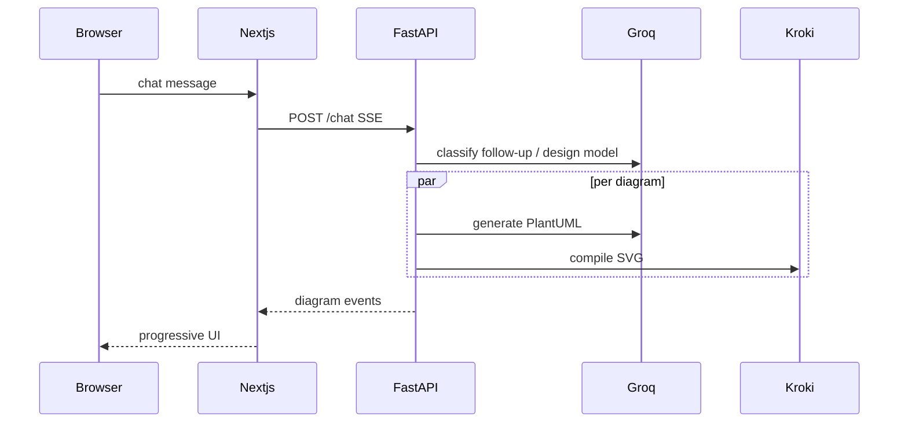

# UML Studio

Chat platform that turns a software-design prompt into a consistent set of UML diagrams (PlantUML → SVG), supports natural-language follow-ups, and stores feedback as ART-compatible trajectories for offline RL training.

## Quick start (one command)

```bash
cp .env.example .env
# set GROQ_API_KEY=... in .env

docker compose up --build
```

Then open **http://localhost:3000**. API docs (loopback only): http://127.0.0.1:18080/docs.

## Local development (without full Docker)

```bash
# Terminal 1 — Kroki (set KROKI_FALLBACK_URL=https://kroki.io in .env only if you accept off-box rendering)
docker compose up kroki

# Terminal 2 — API
source .venv/bin/activate
pip install -r requirements.txt
uvicorn api:app --reload --port 8080

# Terminal 3 — Web
cd web
cp .env.local.example .env.local
npm install
npm run dev
```

## Follow-ups

After the first design, keep chatting. The backend classifies each message:

| Intent | Example | Effect |
|---|---|---|
| `revise` | "add Slack alerts for high-impact gaps" | Appends a revision, updates the shared model, regenerates affected diagrams |
| `edit_diagrams` | "in the sequence diagram, add retries" | Edits only the named diagram(s) |
| `add_diagrams` | "also add a state machine diagram" | Generates new kinds; reuses the rest |
| `remove_diagrams` | "drop the package diagram" | New version without those kinds |
| `question` | "why is there a gap analyzer?" | Answers in markdown; **no new version** |
| `new_design` | "now design a URL shortener instead" | Starts a new conversation |

The original prompt is preserved. Revisions are stored as a numbered list and composed into the effective prompt.

## Architecture



## Technical considerations

### Generate / render UML

LLM returns PlantUML. Kroki compiles to SVG. The Next.js workspace shows zoom/pan canvases (`` + blob URLs), a CodeMirror editor, and SVG/PNG/`.puml` downloads.

### Syntax + consistency

Per-type templates, Kroki compile checks, repair loop, then a **shared design model** so sequence/component/deployment/etc. agree on actors, components, and data stores. Missing names trigger one consistency repair and show as warnings.

### Latency

Groq GPT-OSS models, parallel generation, SSE per diagram, incremental updates, disk caches, local Kroki.

### Feedback for RL

Trajectories + rewards (`training/`). Offline ART GRPO; promote via `GEN_PROVIDER=openai_compat`.

## Models (Groq)

| Role | Default |
|---|---|
| Generate / update / answers | `openai/gpt-oss-120b` |
| Intent / diff / repair / judge | `openai/gpt-oss-20b` |

## Tests

```bash
source .venv/bin/activate
pip install -r requirements-dev.txt
pytest -q
```

## Project layout

See [`BUILD_SPEC.md`](BUILD_SPEC.md) for the function-level implementation guide.
