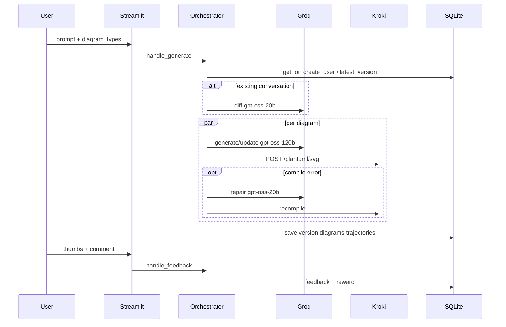

# UML Studio

Chat platform that turns a software-design prompt into validated UML diagrams (PlantUML → SVG), supports prompt updates with incremental regeneration, and stores feedback as ART-compatible trajectories for offline RL training.

## Quick start

```bash
# 1. Python env
python3.11 -m venv .venv
source .venv/bin/activate
pip install -r requirements.txt

# 2. Config
cp .env.example .env
# set GROQ_API_KEY=...

# 3. Kroki (PlantUML renderer)
docker compose up -d kroki

# 4. UI
streamlit run app.py

# Optional API
uvicorn api:app --port 8080
```

Minimum JSON input (also available in the UI JSON mode):

```json
{
  "prompt": "I am working on a compliance monitoring solution which will pull in the latest circulars from SEBI and parse them...",
  "diagram_types": ["sequential", "component", "class", "activity", "deployment", "use_case"]
}
```

## Architecture



| Layer | Role |
|---|---|
| `app.py` | Streamlit chat UI, anon UUID, progressive results |
| `api.py` | FastAPI `/generate`, `/feedback` |
| `core/orchestrator.py` | New / update / feedback flows |
| `core/generator.py` | Parallel per-diagram generation |
| `core/llm.py` | ChatGroq + structured output + rate-limit retry |
| `core/validator.py` | Sanitize, structural check, Kroki compile, repair |
| `core/renderer.py` | Kroki client + SVG cache |
| `core/feedback.py` | Reward composition + LLM judge |
| `training/` | Export trajectories + ART GRPO offline trainer |

## Three user cases

1. **New user** — creates conversation + `DesignVersion v1`, generates all requested diagrams in parallel.
2. **Updated prompt** — fast model diffs prompts; unaffected diagrams are copied forward (`reused_from_id`); affected ones are edited in place.
3. **Feedback** — thumbs ±1 (+ optional comment) stored on trajectories as rewards. `apply_as_update` triggers a revision generate. Offline: `training/export_trajectories.py` → `training/train_art.py`.

## Technical considerations

### 1. Generate / render UML on UI

LLM returns structured JSON `{title, plantuml, notes}`. Backend `POST`s PlantUML to Kroki (`/plantuml/svg`). Streamlit shows SVG via `st.components.v1.html`, plus code tab, edit+re-render, and `.puml`/`.svg` downloads.

### 2. Syntax control

- Per-type PlantUML hints + few-shot examples in prompts
- `sanitize()` strips fences and enforces `@startuml` / `@enduml`
- Structural regex checks (`required_tokens`)
- Kroki compile as ground truth; on 400, `gpt-oss-20b` repairs (max 2)
- Failures surface in UI and lower trajectory reward

### Cross-diagram consistency

Before any diagram is drawn, one call to `gpt-oss-120b` produces a **shared design model** (`core/design_model.py`): actors, components grouped by layer (always including a Presentation component when there are human users), data stores, external systems, domain entities, the ordered main flow, deployment nodes, and a lifecycle. It is saved on the `DesignVersion`.

- Every diagram prompt includes this model plus rules for that diagram type. For example, sequence participants follow the main flow, component packages are the layers, and deployment nodes host every component and data store.
- After a diagram compiles, `enforce_consistency()` checks that it contains the names it requires. Sequence diagrams must have all main-flow participants, component diagrams every component and data store, and use case diagrams every actor. If any are missing, one repair call adds them. Anything still missing shows as a warning in the UI and halves the syntax part of the reward.
- On an updated prompt the model is revised minimally, in parallel with the prompt diff. A diagram is reused only if the diff says it is unaffected and the part of the model it depends on is unchanged.

### 3. Latency

- Groq GPT-OSS-120B (~500 t/s) for generation; 20B (~1000 t/s) for diff/repair/judge
- Parallel `asyncio` generation with progressive UI callbacks
- Incremental updates skip unaffected diagrams
- Disk cache on `(model, kind, prompt)` and SVG hash
- Semaphore + exponential backoff for 250K TPM / 1K RPM limits
- Judge scoring runs off the critical path

### 4. Feedback for RL

- Every LLM call recorded as OpenAI-format messages in `Trajectory`
- Reward = weighted mix of user rating (0.6), syntax/attempts (0.2), judge (0.2)
- ART GRPO is **on-policy**: training rolls out the trainable model; Groq outputs + user ratings inform rewards/RULER, not gradients
- Promote trained weights via vLLM (`GEN_PROVIDER=openai_compat`)

## Models (Groq)

| Role | Default model |
|---|---|
| Generate / update | `openai/gpt-oss-120b` |
| Diff / repair / judge | `openai/gpt-oss-20b` |

Override with `GEN_MODEL` / `FAST_MODEL` in `.env`. Startup calls Groq `/models` and warns if IDs are inactive.

## Training (GPU)

```bash
pip install -r training/requirements-train.txt
python training/export_trajectories.py
python training/train_art.py --dry-run
python training/train_art.py --base-model openai/gpt-oss-20b
# If VRAM limited: --base-model Qwen/Qwen3-8B
```

## Tests

```bash
pip install pytest
pytest -q
```

## Project layout

See [`BUILD_SPEC.md`](BUILD_SPEC.md) for the full function-level implementation guide.
